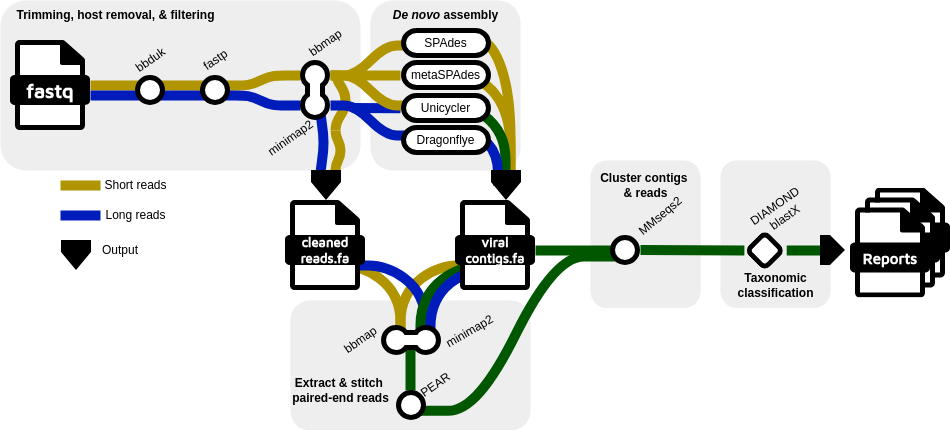

# README 

## Summary
<b> VirusSeeker 2.0 </b> is an updated version of the original [2017 VirusSeeker](https://github.com/guoyanzhao/VirusSeeker-Virome) pipeline that is designed for both virus discovery and virome composition analysis. The pipeline is written in Perl and implemented for high performance computing clusters using SLURM Workload Manager. The README will provide the user with instructions for installation of the proper tools and databases for running VirusSeeker 2.0.



## Files
- The VirusSeeker_2.0_scripts directory contains the scripts required to run the pipeline
- This README and the DATABASE_README should be followed prior to use of VirusSeeker 2.0
- The vs2_env.txt file is used to created the conda environment

## SLURM
- VirusSeeker 2.0 is designed to be used with SLURM Workload Manager
- SLURM installation instructions can be found here: https://slurm.schedmd.com/quickstart_admin.html

## Installation
### Setting up the environment:
- A conda environment needs to be created using the "vs.yml" file  
		` conda create -n vs --file /path/to/vs.yml`  
		` conda activate vs`
- Creating and activating this environment should provide all of the appropriate packages required for setting up and running VirusSeeker 2.0
- If not already installed, Mamba can be found [here](https://mamba.readthedocs.io/en/latest/installation/mamba-installation.html) or Conda can be found [here](https://docs.conda.io/projects/conda/en/latest/index.html#install-svg-version-1-1-width-1-0em-height-1-0em-class-sd-octicon-sd-octicon-download-sd-text-primary-viewbox-0-0-16-16-aria-hidden-true-path-fill-rule-evenodd-d-m7-47-10-78a-75-75-0-001-06-0l3-75-3-75a-75-75-0-00-1-06-1-06l8-75-8-44v1-75a-75-75-0-00-1-5-0v6-69l4-78-5-97a-75-75-0-00-1-06-1-06l3-75-3-75zm3-75-13a-75-75-0-000-1-5h8-5a-75-75-0-000-1-5h-8-5z-path-svg)
	
### Installing databases:
- Please refer to DATABASE_README for database installation
- The previous step, setting up the conda environment, must be completed prior to database installation
- The steps outlined in the DATABASE_README should be followed and completed prior to completing any further steps in this README
	
### Setting Paths:
- Paths to various directories used in VirusSeeker 2.0 are saved in the VS.config file
- The VS.config file should be located in the same directory as the scripts used to run VirusSeeker
- Generic paths are currently in the file, most of which point to a "databases" directory and subdirectories, but you are free to organize this as you see fit

## Running VirusSeeker 2.0 
#### Create output dir:
`mkdir [output path]/[run name]`
#### Move and rename reads and adapter file to output dir (see example dataset for adapter file format):
``` 
mv [path to reads]/sample_R1.fastq.gz [output path]/[run name]/[run_name]_SE1.fastq.gz
mv [path to reads]/sample_R2.fastq.gz [output path]/[run name]/[run_name]_SE2.fastq.gz
mv [path to adapter]/adapter.txt [output path]/[run name]/[run_name]_adapter.txt
```
#### Run VirusSeeker:
```
perl runVS.pl [output path]/[run name] 1 [slurm CPUS] 0 0 D [read type] [sequencing type]		
```
- Read type may be "s", "l" or "h" for short, long or hybrid
- Sequencing type may be "m", or "i" for metagenomic or isolate
- See runVS.pl script for more argument options

<br>

# VirusSeeker 2.0 Results
- VirusSeeker general outputs are in the [job name].AssignmentReport and [job name].AssignmentSummary files
	- The report file contains general processing statistics, counts of sequences across all taxonomic categories, and the viral sequences (along with specific viral classification) in FASTA format
	- The summary file contains all of the above except for the FASTA format sequences
	- It should be noted that non-viral count (Bacteria, Fungi, etc.) should not be considered as representative of raw sample contents, as these counts are only taken after the viral db filtering steps
- The Supplemental Outputs folder contains more accurate counts for reads and contigs
	- VirusSeeker originally counted reads (stitched or unstitched) and contigs as "1" sequence
	- The Supplemental Counts take into account stitching (counting stitched reads as 2) and assembly (counting the reads that were used to assemble the contigs)

## Contact
Reachback Support: usn.detrick.nmrc.mbx.genomics-reach-back@health.mil

## Disclaimer
This work was supported by Navy Work Unit Number A1714.

The views expressed in this article reflect the results of research conducted by the author and do not necessarily reflect the official policy or position of the Department of the Navy, Department of Defense, nor the U.S Government. Several authors are military service members or federal employees of the United States government.

This work was prepared as part of their official duties. Title 17 U.S.C. 105 provides that ‘copyright protection under this title is not available for any work of the United States Government.’ Title 17 U.S.C. 101 defines a U.S. Government work as work prepared by a military service member or employee of the U.S. Government as part of that person's official duties.
